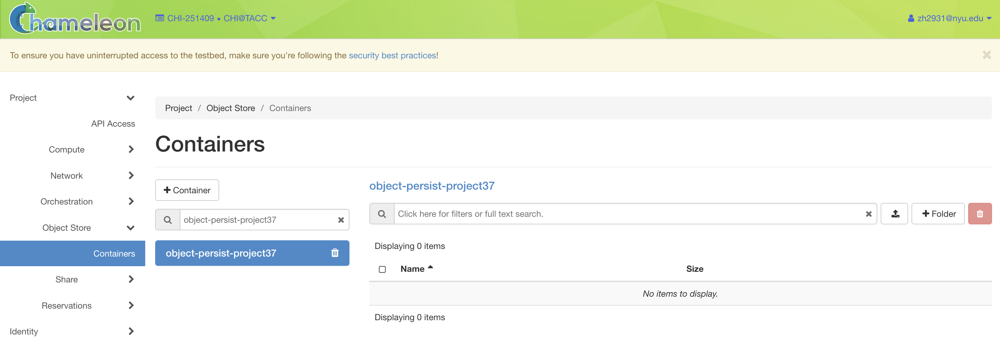
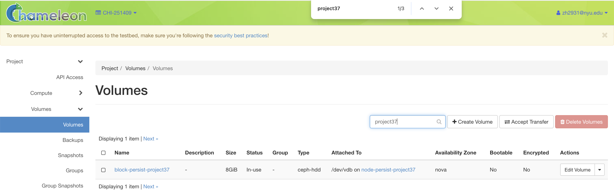

## Data pipeline
### Create a persistent storage on Chameleon
I have created one ob
ject store on Chameleon, to do this, I created and followed `1_create-server.ipynb` and `2_object.ipynb`. 
To summarize the steps I have taken:
* Created a server named `node-persist-project37`. 
* Created `object-persist-project37` under CHI@TACC, authenticate it from my compute instance
* Retrieved code on our team github repo, and performed the ELT pipeline using docker (under `docker/docker-compose-etl`)
* Mounted our object store to local file system



In our object store, under `/mnt/object`, it contains the MovieLens raw, training, testing, evaluation dataset of ~6GB.


I have created three block storage on Chameleon, to do this, I created and followed `3_block.ipynb`.
To summarize the steps I have taken:
* Created `block-persist-project37` under KVM@TACC, attached it to `node-persist-project37`
* Created docker volumes on persistent storage
  * `/mnt/block/postgres_data` contains the user info (userId and itemId)
  * `/mnt/block/minio_data` contains model artifacts
  * `mlflow` contains experiment artifacts



### Offline Data:
For offline data, MovieLens 192M dataset is used, which contains user–movie interactions (userId, itemId), rating and timestamp.
Data Lineage:
* Original data: `rating.csv` from MovieLens 192M from external source.
* Transformed data: `rating.cvs` stored persistently in `/mnt/object/ml-192m`
* Divided data: 
  * training data under `/mnt/object/training/movielens_192m_train.txt`
  * evaluation data under `/mnt/object/evaluation/movielens_192m_eval.txt`
  * testing data under `/mnt/object/testing/movielens_192m_test.txt`
### Online Data: 
For online data, I simulated real-user interactions to evaluate the SSE-PT model. I used evaluation dataset which had 
been divided during ETL pipeline (`movielens_192m_eval.txt`) to evaluate the model on unseen data. 
This evaluation file has been mounted from object store under  `/mnt/object/evaluation`.

The simulation logic contains in `demo.ipynb` under `workspaces`. I first cleaned and formatted by ID clipping that 
ensure userId and itemId are within training range of 10000. Then we pass a dummy user interaction sequence to model (`models/SSE_PT.pth`)
as user history.

This can be monitored through running `nload ens3` command on `node-persist-project37`.

### Data Pipeline:
I created a docker compose file for ETL process under `docker/docker-compose-etl.yaml`.

In data extract phase, I extracted the zip file movie lens 192M dataset from external source (https://nyu.box.com/s/5r8m3rvjfejcip7nqurf9jbpi5rw5ri1), 
and unzipped it.

In data transform, I sorted the ratings.csv file based on timestamps since our SSE_PT 
is sequential based and the order of time of user activity need to be taken into consideration. 
Then, I dropped the rating and timestamp column. Lastly, I split the transformed dataset into training (50%), 
evaluation (25%), and testing (25%).

In the data load phase, I used an etl_load_data container (based on rclone) 
to upload the processed dataset to an object store bucket 
(chi_tacc:$RCLONE_CONTAINER) on Chameleon. 
The service clears old contents, uploads the new dataset from /data/Project-37.

### Data Pipeline Diagram
```
                        +-----------------------------+
                        |     External Data Source:    |
                        | MovieLens ZIP from NYU Box   |
                        +-------------+---------------+
                                      |
                                      v
                        +-------------+---------------+
                        |       ETL Container          |
                        | (docker-compose-etl.yaml)    |
                        | - Extract                    |
                        | - Transform                  |
                        | - Load                       |
                        +-------------+---------------+
                                      |
                                      v
                        +-----------------------------+
                        |  Chameleon Object Store      |
                        | Mounted at /mnt/object       |
                        | - /ml-192m                   |
                        | - /training                  |
                        | - /evaluation                |
                        | - /testing                   |
                        +-------------+---------------+
                                      |
                                   Used by 
                                      |
       +-------------------+      +----------------+       +----------------+
       |     Jupyter       | ---> |    MLflow      | --->  |    Postgres    |
       |                   |      |                |       |                |      
       +-------------------+      +--------+-------+       +----------------+
                                           |
                                           v
                                  +----------------+
                                  |     MinIO      |
                                  +----------------+
```
