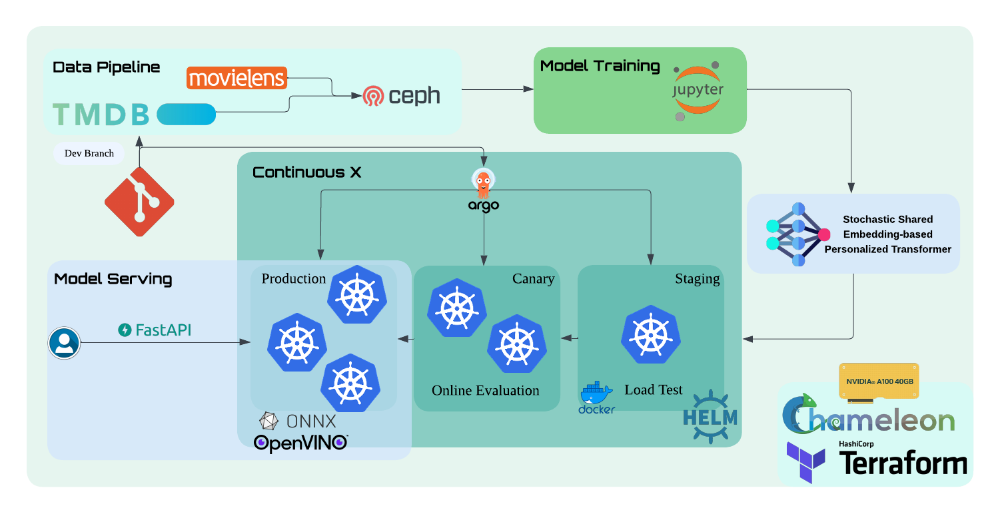
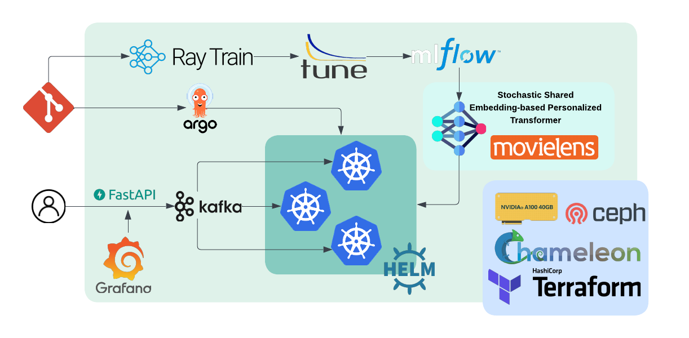
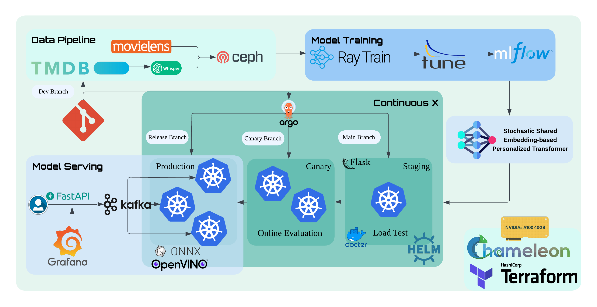

# Final Delivery - Unit 2/3 Continuous X

This section documents the implementation of our Continuous Integration/Continuous Deployment (CI/CD) pipeline and infrastructure-as-code approach for the movie recommendation system.

## Project Structure

The project is organized into three main components:

1. **Infrastructure as Code (IaC)**
   - Located in [project_IaC](https://github.com/zuchuandatou/MLSysEngOps-NYU25Spring/blob/zehao-li-cicd/project_IaC.ipynb)
   - Handles the provisioning and configuration of all cloud infrastructure
   - Includes install Terraform / Ansible / Argo / k8s

2. **Project Stages**
   - Located in [project_stages](https://github.com/zuchuandatou/MLSysEngOps-NYU25Spring/blob/zehao-li-cicd/project_stages.ipynb)
   - Run Ansible playbook for managing the implementation of our three-stage deployment process

3. **Project Lifecycles**
   - Located in [project_lifecycles](https://github.com/zuchuandatou/MLSysEngOps-NYU25Spring/blob/zehao-li-cicd/project_lifecycles.ipynb)
   - Run Ansible playbook for managing the model promotion workflow from staging to production
   - Handles model retraining, containerization, and deployment across stages

## Updated System Architecture



## Infrastructure and Infrastructure-as-Code

Our infrastructure is fully defined using Terraform, with all cloud resources and configurations managed as code. The infrastructure code can be found in our [IaC terraform dir](https://github.com/zuchuandatou/MLSysEngOps-NYU25Spring/tree/zehao-li-cicd/tf/kvm).

Key components:
- Kubernetes cluster provisioning (node 1 2 3)
- Storage volumes (Block storage)
- Network configurations
- Security groups and access controls

## CI/CD Pipeline

We implemented a comprehensive CI/CD pipeline using Ansible and ArgoCD for workflow orchestration. The pipeline configuration can be found in our [ansible playbooks that run argocd](https://github.com/zuchuandatou/MLSysEngOps-NYU25Spring/tree/zehao-li-cicd/ansible/argocd).

### Staged Deployment Process

Our deployment strategy follows a three-stage approach:

1. **Staging Environment**   
https://github.com/zuchuandatou/MLSysEngOps-NYU25Spring/blob/zehao-li-cicd/ansible/argocd/argocd_add_staging.yml

2. **Canary Deployment**  
https://github.com/zuchuandatou/MLSysEngOps-NYU25Spring/blob/zehao-li-cicd/ansible/argocd/argocd_add_canary2.yml

3. **Production Environment**  
https://github.com/zuchuandatou/MLSysEngOps-NYU25Spring/blob/zehao-li-cicd/ansible/argocd/argocd_add_prod.yml

### Model Retraining and Deployment Workflow

We implemented an automated workflow for model retraining and deployment:

1. Trigger retraining pipeline
2. Build new model container
3. Register model in model registry
4. Promote model through stages (staging → canary → production)
5. Deploy updated model

The workflow configuration can be found in our [workflow dir](https://github.com/zuchuandatou/MLSysEngOps-NYU25Spring/tree/zehao-li-cicd/workflows).


## Application Implementation 

We developed a complete application stack:

### Backend (FastAPI)
- Model serving API
- RESTful endpoints for recommendations
- Containerized deployment

### Frontend (React)
- Real-time recommendation updates

### Demo Implementation
- 3 dummy users with predefined watch histories
- Basic user interaction simulation

The application code can be found in our [application repository](https://github.com/zuchuandatou/MLSysEngOps-NYU25Spring/tree/app-staging).

---

# Final Develivery Readme


## Scalable MLOps System for Personalized Movie Recommendation with Real-Time Monitoring
<!-- 
Discuss: Value proposition: Your will propose a machine learning system that can be 
used in an existing business or service. (You should not propose a system in which 
a new business or service would be developed around the machine learning system.) 
Describe the value proposition for the machine learning system. What's the (non-ML) 
status quo used in the business or service? What business metric are you going to be 
judged on? (Note that the "service" does not have to be for general users; you can 
propose a system for a science problem, for example.)
-->


Current recommendation systems, including Netflix's, often rely heavily on behavioral data and content metadata, using static models that lack adaptability to rapidly changing user preferences. These systems may overlook richer data modalities like audio and video content, limiting their ability to personalize in cold-start or nuanced scenarios.  

Our project introduces an automated MLOps pipeline for personalized movie recommendations using the Enhanced MovieLens dataset which includes text, metadata, audio, and trailer transcriptions, and a Transformer-based model (SSE-PT). We streamline training, tuning, deployment, and monitoring using Ray, MLflow, FastAPI, and Kubernetes with GitOps support via ArgoCD and Helm.

The system enables low-latency online inference, real-time performance tracking, and fast retraining cycles. Business metrics such as model responsiveness will guide evaluation, offering a scalable, adaptive alternative to traditional manual workflows.

### Contributors

<!-- Table of contributors and their roles. 
First row: define responsibilities that are shared by the team. 
Then, each row after that is: name of contributor, their role, and in the third column, 
you will link to their contributions. If your project involves multiple repos, you will 
link to their contributions in all repos here. -->

| Name                            | Responsible for | Link to their commits in this repo |
|---------------------------------|-----------------|------------------------------------|
| All team members                | Rest of the project                |    -                                |
| Jiayi Zhang                     | Model Training                     |    -                                |
| Ziqi Zhou                       | Model Serving                      |    -                                |
| Ziyi Huang                      | Data Pipeline                      |    -                                |
| Zehao Li                        | Continuous X                       |    https://github.com/zuchuandatou/MLSysEngOps-NYU25Spring/commits/main?author=zuchuandatou                                |


### System diagram

<!-- Overall digram of system. Doesn't need polish, does need to show all the pieces. 
Must include: all the hardware, all the containers/software platforms, all the models, 
all the data. -->




(Refined System Diagram after Lightning Presentation)
### Summary of outside materials

<!-- In a table, a row for each dataset, foundation model. 
Name of data/model, conditions under which it was created (ideally with links/references), 
conditions under which it may be used. -->

|              | How it was created | Conditions of use |
|--------------|--------------------|-------------------|
| [MovieLens 1B](https://grouplens.org/datasets/movielens/movielens-1b/)   (3.1GB)|  Collected by GroupLens Research from user rating activity over time.                  |   Available for non-commercial research use only.                |
| [Enhanced MovieLens](https://zenodo.org/records/8037433)  (~50GB, but we only use 5GB) |   Enriching the MovieLens dataset by incorporating metadata available on the web (such as cast, description, keywords, etc.) and movie trailers                 |     Creative Commons Attribution Non Commercial Share Alike 4.0 International              |
| [Stochastic Shared Embedding-based Personalized Transformer](https://github.com/hzsnow/NYU-ECE-GY-7123-Deep-Learning-Final-Project) |                      Created for NYU ECE-7123 Deep Learning Final Project              |  Available for non-commercial research use only. |


### Summary of infrastructure requirements

<!-- Itemize all your anticipated requirements: What (`m1.medium` VM, `gpu_mi100`), 
how much/when, justification. Include compute, floating IPs, persistent storage. 
The table below shows an example, it is not a recommendation. -->

| Requirement     | How many/when                                     | Justification |
|-----------------|---------------------------------------------------|---------------|
| `m1.medium` VMs | 3 for entire project duration                     | Used for orchestration components like ArgoCD, Helm, and Kubernetes master/control plane.        |
| `gpu_a100`      | 4 hour blockm, 3 times a week                     |  Required for distributed training with Ray Train and hyperparameter tuning with Ray Tune.             |
| Floating IPs    | 1 for entire project duration, 1 for sporadic use | One for accessing services (eg., FastAPI, Grafana); one temporary for debug/test deployments.              |
| Persistent Storage | 100G for entire project duration               | Storage needed for training data, model checkpoints, logs, and MLFlow tracking.

### Detailed design plan

<!-- In each section, you should describe (1) your strategy, (2) the relevant parts of the 
diagram, (3) justification for your strategy, (4) relate back to lecture material, 
(5) include specific numbers. -->

#### Model training and training platforms

<!-- Make sure to clarify how you will satisfy the Unit 4 and Unit 5 requirements, 
and which optional "difficulty" points you are attempting. -->
We trained and re-trained a Transformer-based model (SSE-PT) for session-based recommendations using both the MovieLens-1M and Wiki1000 datasets, demonstrating modeling choices grounded in recent research.
We plan to scale training using Ray Train and compare distributed vs. single-GPU training to explore strategies for large models.
We will host an experiment tracking server (e.g., MLflow) on Chameleon Cloud and log all experiments.
Additionally, we will deploy a Ray cluster on Chameleon and schedule our training jobs there, with the goal of integrating Ray Tune for hyperparameter tuning to gain extra difficulty points.

#### Model Serving: 
A RESTful API endpoint will be implemented using FastAPI. The service will be containerized and deployed on Kubernetes with support for asynchronous and batched inference. 

##### Performance Requirements:
The system targets low-latency online inference and efficient batch throughput, with support for concurrent requests.

##### Model-Level Optimizations:
- Export models to ONNX format
- Apply graph optimizations and post-training quantization (both static and dynamic)
- Use hardware-specific backends like TensorRT and OpenVINO

##### System-Level Optimizations:
- Enable request batching
- Use Kubernetes HPA for autoscaling
- All components will run in containers for isolated, scalable deployments

##### Performance Requirements
- `raw-data/` → Raw movie data (MovieLens dataset)
- `processed-data/` → Cleaned-up data
- `models/` → Trained models
- `logs/` → User activity logs

##### Multiple Deployment Targets (Extra Difficulty Point):
- GPU-based serving
- CPU-only serving
- Edge-device (quantized, lightweight model for mobile/offline use)

#### Evaluation & Monitoring
A RESTful API endpoint will be implemented using FastAPI. The service will be containerized and deployed on Kubernetes with support for asynchronous and batched inference. 

##### Offline Evaluation:
After each training run, automated scripts will evaluate accuracy, diversity, cold-start coverage, etc.
Results will be logged to MLflow, and used to determine model registration.

##### Staging Load Testing:
Deploy the service to a staging environment and run load tests to validate latency, error rates, and container stability under traffic.

##### Canary Deployment:
Gradually route a portion of traffic to a canary model version for online evaluation.
Compare key metrics (e.g., click-through rate) with the production version before full rollout.

##### Feedback Loop:
Log user interactions (e.g., views, clicks) to generate new training data for model retraining.
Set up pipelines to transform logs into labeled data.

##### Business-Specific Evaluation Plan:
Define metrics such as CTR improvement and recommendation diversity for business value assessment.
Simulate realistic user behavior for evaluation, if needed.

##### Monitoring Capabilities (Extra Difficulty Point):
- Monitor data drift and model degradation in real-time
- Alert engineers and trigger retraining if needed
- Visualize model performance using dashboards


#### Data pipeline

<!-- Make sure to clarify how you will satisfy the Unit 8 requirements,  and which 
optional "difficulty" points you are attempting. -->

##### Persistent storage:
- Using Chameleon's storage (Ceph)
##### Offline Data:
- `raw-data/` → Raw movie data (MovieLens dataset)
- `processed-data/` → Cleaned-up data
- `models/` → Trained models
- `logs/` → User activity logs
##### Online Data: 
- Simulate user interaction with movie data
##### Data Pipeline:
[Data Sources] → [Ingestion] → [Cleaning] → [Feature Store]
##### Difficulty Point: Interactive Dashboard
- Use Grafana to visualize user activity pattern and recommendation performance


#### Continuous X
to pull code at jupyter interface:
```
git clone --recurse-submodules https://github.com/zuchuandatou/MLSysEngOps-NYU25Spring.git /work/MLSysEngOps-NYU25Spring
```


<!-- Make sure to clarify how you will satisfy the Unit 3 requirements,  and which 
optional "difficulty" points you are attempting. -->


##### Strategy

To meet the Unit 3 DevOps requirements, our project will follow a cloud-native, infrastructure-as-code approach with fully automated CI/CD and continuous training pipelines. Our infrastructure and services will be defined declaratively using Terraform and Helm, and stored in a Git repository. We will adopt a microservices architecture, containerizing each service using Docker and orchestrating deployments via Kubernetes. The CI/CD pipeline will handle model training, evaluation, container packaging, and staged deployment (staging → canary → production) automatically.

##### Relevant Diagram Components

- **Infrastructure Layer**: Defined in Terraform and provisioned on the cloud provide Chameleon, and potentially possibility to extend to commercial clouds(e.g., GCP or AWS), using Kubernetes as the orchestration platform.
- **Model Training Pipeline**: Built using Argo Workflows, triggered by commits to the training code or data updates.
- **CI/CD Pipeline**: Implemented using GitHub Actions and ArgoCD. Handles linting, testing, model training, containerization, and deployment.
- **Environments**: We define distinct namespaces for `staging`, `canary`, and `production`, with promotion mechanisms.

### Frontend Application Setup

To install and run the frontend application:

1. **Clone the repository and navigate to the frontend directory**
   ```bash
   git clone https://github.com/zuchuandatou/MLSysEngOps-NYU25Spring.git
   cd MLSysEngOps-NYU25Spring/app/frontend
   ```

2. **Install dependencies**
   ```bash
   npm install
   ```

3. **Start the development server**
   ```bash
   npm start
   ```
   The application will be available at http://localhost:3000

4. **For production deployment**
   ```bash
   npm run build
   ```
   This creates optimized files in the `build` directory that can be served by any static file server.

5. Add TMDB api key to app.js or env

#### Requirements
- Node.js (v14 or higher)
- npm (comes with Node.js)

### Backend API Setup

1. **Navigate to the app directory**
   ```bash
   cd MLSysEngOps-NYU25Spring/app
   ```

2. **Install Python dependencies**
   ```bash
   pip install -r requirements.txt
   ```


3. **Start the Flask server**
   ```bash
   python app.py
   ```
   The API will be available at http://127.0.0.1:5000

4. **Test the API with curl**
   ```bash
   curl -X POST http://127.0.0.1:8000/predict \
     -H "Content-Type: application/json" \
     -d '{"user_id": 1, "sequence": [3, 8, 15], "top_k": 3}'
   ```

#### API Endpoints
- `POST /predict` - Get movie recommendations for a user
  - Request body: `{"user_id": int, "sequence": [int, int, ...], "top_k": int}`
  - Response: `{"top_items": [id1, id2, ...]}`

### Docker Setup
```
cd app/
docker-compose up
```

#### Requirements
- Python 3.8+
- PyTorch
- Flask
- Flask-CORS

